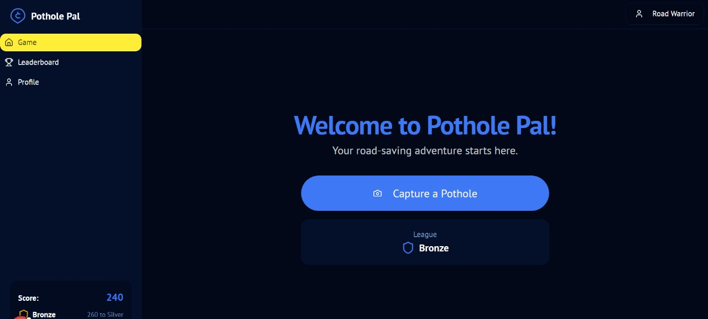
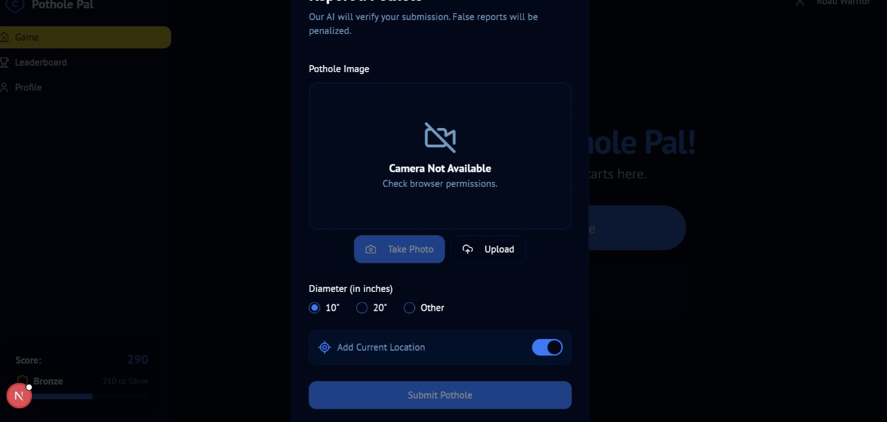
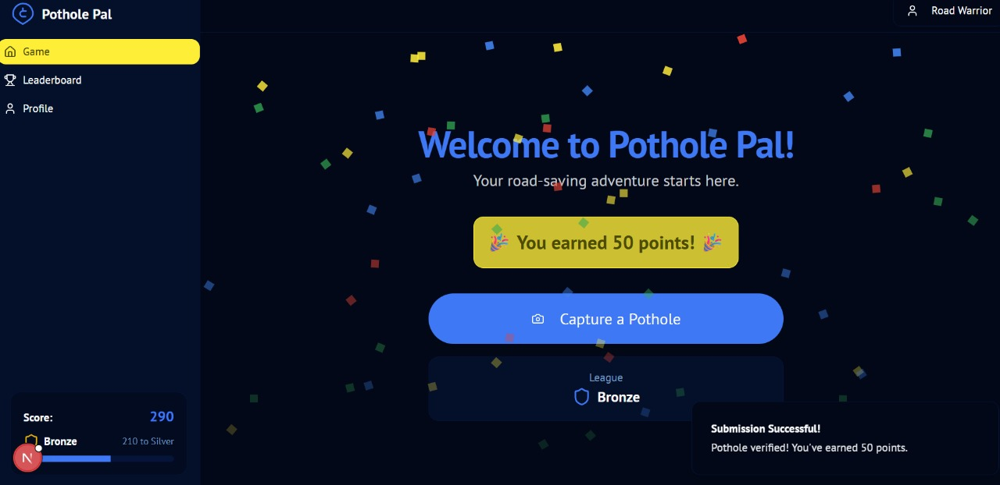

# Road Evde 🎯

## Basic Details
### Team Name: Useless Engineers

### Team Members
- Team Lead: Akshitha Francis - Adi Shankara College of Engineering 
- Member 2: Aadhil K Salim - Adi Shankara College of Engineering

### Project Description
PotholeGO turns the civic nightmare of potholes into a competitive mobile game. Spot potholes, upload photos, earn points, and rise through the leagues — because road damage deserves recognition.
### The Problem (that doesn't exist)
Roads these days? Way too smooth. Where’s the excitement? The drama? The risk of losing a tire? Worse, no one’s rewarding citizens for their elite pothole-spotting skills. We've been living in a world where potholes go unmeasured, untagged, and — most importantly — unscored. A tragedy.

### The Solution (that nobody asked for)
We fixed it by gamifying the chaos. With PotholeGO, you can snap potholes, measure their glory, tag the GPS, and get rewarded. 10-inch pothole? +50 points. 20-inch monster? +100 points. Climb leagues, earn badges, and become the world’s top Pothole Hunter. It's like Pokémon Go — but for craters.

## Technical Details
### Technologies/Components Used
For Software:

Languages: JavaScript, TypeScript

Frameworks: React Native, Firebase Functions

Libraries: Expo (camera/location), React Navigation, Firebase SDK, Lottie, SoundPlayer

Tools: Firebase (Auth, Firestore, Storage), VS Code, Figma

### Implementation
For Software:
# Installation
[commands]

# Run
[commands]
npx create-expo-app PotholeGO --template
cd PotholeGO

npm install firebase
npm install @react-navigation/native @react-navigation/native-stack
npx expo install react-native-screens react-native-safe-area-context react-native-gesture-handler react-native-reanimated
npx expo install expo-camera expo-location expo-media-library expo-image-picker
npm install react-native-paper
npx expo install @expo/vector-icons
npx expo install lottie-react-native
npx expo install expo-av

### Project Documentation
For Software:

# Screenshots (Add at least 3)

*Add caption explaining what this shows*

*Add caption explaining what this shows*

*Add caption explaining what this shows*

---
Made with ❤️ at TinkerHub Useless Projects 

